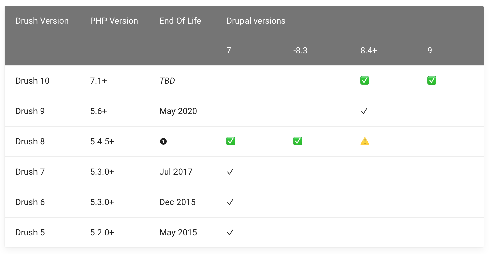

# Drush 10

Compatibilité : [https://www.drush.org/latest/install/#drupal-compatibility](https://www.drush.org/latest/install/#drupal-compatibility)



## DOCS :



DRUSH 9.x doc : [https://docs.drush.org/en/9.x/](https://docs.drush.org/en/9.x/)

## Drush + MAMP

[**Working with Drush on  MAMP**](https://www.drupal.org/node/1651282)****

Problèmes de connexion SQL avec Drush : _`SQLSTATE[HY000] [2002] No such file or directory`_

* [J'ai \`PDOException: SQLSTATE \[HY000\] \[2002\] Aucun fichier ou répertoire de ce type\` lors de l'utilisation de drush \[fermé\]](https://qastack.fr/drupal/99446/ive-got-pdoexception-sqlstatehy000-2002-no-such-file-or-directory-when-u)
* [https://www.drupal.org/node/1651282](https://www.drupal.org/node/1651282)

La solution rapide qui à fonctionné du premier coup pour moi, sur projet DRUPAL 9 :&#x20;

```
Rajout de la ligne :
'unix_socket' => '/Applications/MAMP/tmp/mysql/mysql.sock'
dans le /web/sites/default/settings.local.php :
//
$databases['default']['default'] = array (
  'database' => 'xxs_urban-elab',
  'username' => 'root',
  'password' => 'root',
  'prefix' => '',
  'host' => 'localhost',
  'port' => '3306',
  'namespace' => 'Drupal\\Core\\Database\\Driver\\mysql',
  'driver' => 'mysql',
  'unix_socket' => '/Applications/MAMP/tmp/mysql/mysql.sock'
);

```

## Commandes

```
// An overview of the environment
drush status

// drush cache-rebuild
drush cr

// Liste de tous les modules activés
// https://www.drush.org/latest/commands/pm_list/
drush pm-list --type=Module --status=enabled

// Liste de tous les modules activés NON-core (= contrib)
// https://www.drush.org/latest/commands/pm_list/
drush pm-list --type=Module --status=enabled --no-core

// list of uninstalled (contrib) modules
// Liste des modules CONTRIB non activés/installés
drush pm:list --type=Module --status="disabled,not installed" --no-core 
```

