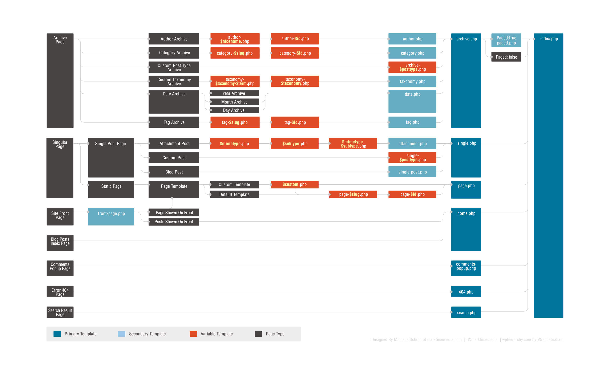

# Theming

## Common Template files

wp doc =&gt; [Template Hierarchy](https://developer.wordpress.org/themes/basics/template-hierarchy/)[  
The WordPress template hierarchy](https://wphierarchy.com/) =&gt; interactif \*\*\*

## Template Tags

wp doc =&gt; [https://developer.wordpress.org/themes/basics/template-tags/](https://developer.wordpress.org/themes/basics/template-tags/) \*\*\*

* [`next_post_link()`](https://developer.wordpress.org/reference/functions/next_post_link/) – a link to the post published chronologically _after_ the current post
* [`previous_post_link()`](https://developer.wordpress.org/reference/functions/previous_post_link/) – a link to the post published chronologically _before_ the current post
* [`the_category()`](https://developer.wordpress.org/reference/functions/the_category/) – the category or categories associated with the post or page being viewed
* [`the_author()`](https://developer.wordpress.org/reference/functions/the_author/) – the author of the post or page
* [`the_content()`](https://developer.wordpress.org/reference/functions/the_content/) – the main content for a post or page
* [`the_excerpt()`](https://developer.wordpress.org/reference/functions/the_excerpt/) – the first 55 words of a post’s main content followed by an ellipsis \(…\) or read more link that goes to the full post. You may also use the “Excerpt” field of a post to customize the length of a particular excerpt.
* [`the_ID()`](https://developer.wordpress.org/reference/functions/the_id/) – the ID for the post or page
* [`the_meta()`](https://developer.wordpress.org/reference/functions/the_meta/) – the custom fields associated with the post or page
* [`the_shortlink()`](https://developer.wordpress.org/reference/functions/the_shortlink/) – a link to the page or post using the url of the site and the ID of the post or page
* [`the_tags()`](https://developer.wordpress.org/reference/functions/the_tags/) – the tag or tags associated with the post
* [`the_title()`](https://developer.wordpress.org/reference/functions/the_title/) – the title of the post or page
* [`the_time()`](https://developer.wordpress.org/reference/functions/the_time/) – the time or date for the post or page. This can be customized using standard php date function formatting.

## Conditional Tags

wp doc =&gt; [https://developer.wordpress.org/themes/basics/conditional-tags/](https://developer.wordpress.org/themes/basics/conditional-tags/) \*\*\*

* [`is_home()`](https://developer.wordpress.org/reference/functions/is_home/) – Returns true if the current page is the homepage
* [`is_admin()`](https://developer.wordpress.org/reference/functions/is_admin/) – Returns true if inside Administration Screen, false otherwise
* [`is_single()`](https://developer.wordpress.org/reference/functions/is_single/) – Returns true if the page is currently displaying a single post
* [`is_page()`](https://developer.wordpress.org/reference/functions/is_page/) – Returns true if the page is currently displaying a single page
* [`is_page_template()`](https://developer.wordpress.org/reference/functions/is_page_template/) – Can be used to determine if a page is using a specific template, for example: `is_page_template('about-page.php')`
* [`is_category()`](https://developer.wordpress.org/reference/functions/is_category/) – Returns true if page or post has the specified category, for example: `is_category('news')`
* [`is_tag()`](https://developer.wordpress.org/reference/functions/is_tag/) – Returns true if a page or post has the specified tag
* [`is_author()`](https://developer.wordpress.org/reference/functions/is_author/) – Returns true if inside author’s archive page
* [`is_search()`](https://developer.wordpress.org/reference/functions/is_search/) – Returns true if the current page is a search results page
* [`is_404()`](https://developer.wordpress.org/reference/functions/is_404/) – Returns true if the current page does not exist
* [`has_excerpt()`](https://developer.wordpress.org/reference/functions/has_excerpt/) – Returns true if the post or page has an excerpt

[The Ultimate Guide to WordPress Conditional Tags](https://www.isitwp.com/ultimate-guide-wordpress-conditional-tags/) - 2019

* [is\_home\(\)](http://codex.wordpress.org/Function_Reference/is_home) – Checks if the blog post index is being displayed. This may or may not be your home page as well.
* [is\_front\_page\(\)](http://codex.wordpress.org/Function_Reference/is_front_page) – Checks if your home page is being displayed. This works whether your front page settings are set up to display blog posts \(i.e. blog index\) or a static page.
* [is\_single\(\)](http://codex.wordpress.org/Function_Reference/is_single) – Checks to see whether any type of single post is being displayed \(excluding attachments\).
* [is\_attachment\(\)](http://codex.wordpress.org/Function_Reference/is_attachment) – Checks if an attachment is displayed.
* [is\_page\(\)](http://codex.wordpress.org/Function_Reference/is_page) – Checks if a page is being displayed.
* [is\_singular\(\)](http://codex.wordpress.org/Function_Reference/is_singular) – Checks whether a single post, attachment or page is being displayed. True is returned if either of those conditions are met.
* [is\_category\(\)](http://codex.wordpress.org/Function_Reference/is_category) – Checks whether a category archive page is being displayed.
* [is\_search\(\)](http://codex.wordpress.org/Function_Reference/is_search) – Checks if a search results page is being shown.
* [is\_tag\(\)](http://codex.wordpress.org/Function_Reference/is_tag) – Checks whether a tag archive is being displayed.
* [is\_author\(\)](http://codex.wordpress.org/Function_Reference/is_author) – Checks if an author archive page is being displayed.
* [is\_archive\(\)](http://codex.wordpress.org/Function_Reference/is_archive) – Checks if any type of archive page is being displayed including category, tag, date and author archives.
* [is\_sticky\(\)](http://codex.wordpress.org/Function_Reference/is_sticky) – Checks if a post has been defined as [sticky](http://codex.wordpress.org/Sticky_Posts).
* [is\_multi\_author\(\)](http://codex.wordpress.org/Function_Reference/is_multi_author) – Checks if more than one author has published posts on the website. True is returned if two or more people have published posts. If only one author has published posts, or if no posts have been published at all, false is returned.

